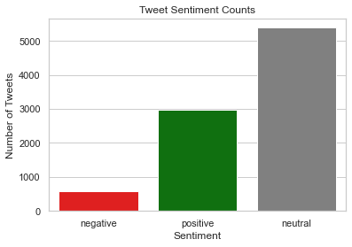
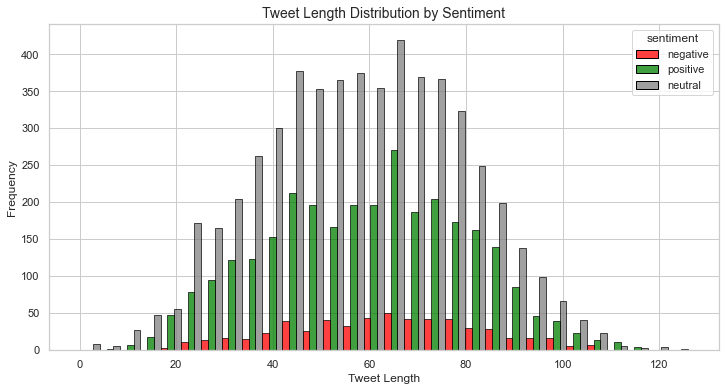

# Phase 4 Project

* Group: *Group 1* 
* Student names: *Faith Kanyuki, Marybennah Kuloba, Sharon Thiga, Sharon Maina* 
* Student pace: *Part Time* 
* Instructor name: *Christine Kirimi* 

# Measuring Public Perception of Apple and Google Products on Twitter
## 1. Project Overview
The aim of this project is to build a Natural Language Processing (NLP) model to classify tweets mentioning Apple or Google into positive, negative, or neutral sentiments. This will help understand public perception, monitor brand reputation, and inform marketing and product strategies. 
This project will enable businesses to:

* Adjust their campaigns based on trends in sentiment
* Prioritize responses when negative sentiment spikes.
* Identify common issues or requests from user feedback.
* Detect negative trends early to mitigate PR risks.

## 2. Business Problem
Our analysis will give insights on the following questions:

* How do people feel about Apple vs Google products on social media?
* Which words or phrases are most influential in expressing sentiment?
* Do specific events or product launches trigger changes in sentiment?

## 3. Data Understanding
For this analysis, we used the [crowdflower dataset](https://data.world/crowdflower/brands-and-product-emotions) which contains over 9,000 tweets about Apple and Google products. The dataset has tweets from real users in the form of unstructured text. Each tweet is labelled as expressing either positive emotion, negative emotion or no emotion, making it suitable for supervised Machine Learning.

## 4. Data Cleaning and Preparation
1. **Dropping unwanted columns**: Retained only the columns that contain the tweets and the sentiment label.
2. **Handling Missing Values**: Dropped rows with missing sentiment labels and replaced missin values in the tweet column with appropriate placeholders.
3. **Renaming Columns**: Columns were renamed to make them more intuitive.
4. **Removing Unwanted Sentiment Categories**: Retained only the tweets that are labelled as having either positive, negative or neutral sentiment.
5. **Cleaning Text Data**: Converted text to lowercase. Removed URLs, mentions, hashtags, punctuation marks, numbers, whitespace. Removed stopwords.
6. **Tokenization and Lemmatization**: Converted each tweet to a list of tokens afterwhich lemmatization was applied.
7. **Word Vectorization**: Utilized the TF-IDF Vectorizer to assign weights to each word based on the rarerity of the word in the corpus.

### 4.1 Exploratory Data Analysis
#### Distribution of Tweet Sentiments
 

  

 - majority of the tweets are neutral or positive, with negative reactions being minimal. 
 - This can guide marketing and customer engagement strategies to maintain positive sentiment while monitoring negative feedback for potential improvements.

#### Tweet Length by Sentiment
 

  

- Positive tweets have mostly between 50 - 100 characters, suggesting that users expressing positive emotions are likely to share detailed feedback or experiences.
- Negative tweets cluster around 20 - 80 characters, indicating brief and direct texts reflecting frustration or immediate reactions.
- Neutral tweets have a broader range. They are likely to be informational or descriptive texts that stick to the facts rather than conveying emotion.

